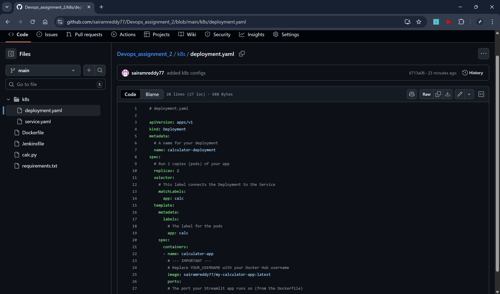
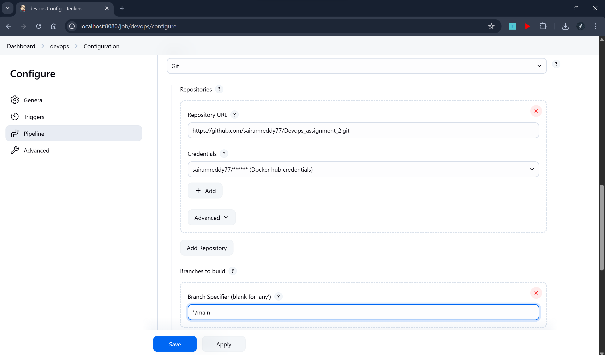
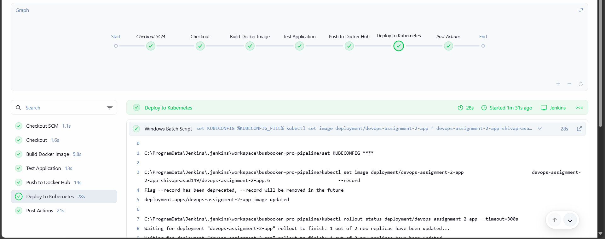
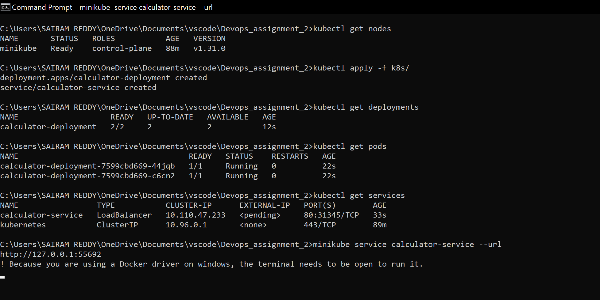
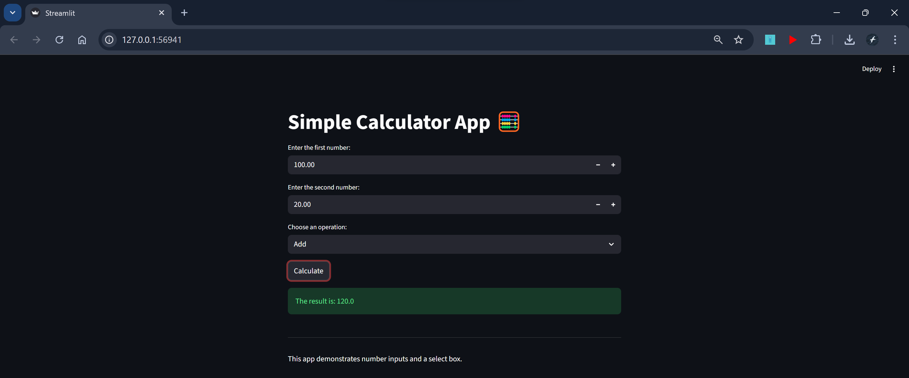

# DevOps Assignment 2 - Streamlit Application with CI/CD Pipeline

A production-ready Streamlit web application with complete CI/CD pipeline using Jenkins, Docker, and Kubernetes deployment.

## 🎯 Overview

This project demonstrates a complete DevOps workflow for a Streamlit web application, including:

- Containerized application using Docker
- Automated CI/CD pipeline with Jenkins
- Kubernetes orchestration for production deployment
- Automated testing and deployment stages

## 🌐 About Web Application

This website is a modern Bus Booking System (BusBooker Pro) that allows users to search for bus routes, select seats, and complete payments. The platform features responsive design, real-time seat selection, and secure payment processing. Users can view available buses, select preferred seats, and complete bookings with an intuitive interface.

## ✨ Features

- **Streamlit Web Application**: Lightweight Python web server
- **Docker Containerization**: Multi-stage Docker builds for optimized images
- **Kubernetes Deployment**: Production-ready K8s manifests with 2 replicas
- **Jenkins Pipeline**: Automated build, test, and deployment
- **Docker Hub Integration**: Automated image push to Docker Hub registry
- **Load Balancing**: Kubernetes LoadBalancer service for external access

## 🏗️ Architecture

```
┌─────────────┐     ┌──────────────┐     ┌─────────────────────────┐
│   GitHub    │────▶│   Jenkins    │────▶│ Docker Hub Registry     │
│ Repository  │     │   Pipeline   │     │ sairamreddy77/         │
└─────────────┘     └──────────────┘     │ devops-assignment-2-app │
                           │              └─────────────────────────┘
                           │                      │
                           │                      │
                           ▼                      ▼
                    ┌──────────────┐     ┌─────────────────────────┐
                    │ Kubernetes   │◀────│   Docker Image          │
                    │   Cluster    │     │ devops-assignment-2-app │
                    └──────────────┘     └─────────────────────────┘
                           │
                           ▼
                    ┌──────────────┐
                    │ LoadBalancer │
                    │   Service    │
                    └──────────────┘
```

## 📦 Prerequisites

Before you begin, ensure you have the following installed:

- **Python 3.9+**: [Download Python](https://www.python.org/downloads/)
- **Docker**: [Install Docker](https://docs.docker.com/get-docker/)
- **Kubernetes (kubectl)**: [Install kubectl](https://kubernetes.io/docs/tasks/tools/)
- **Minikube** (for local K8s): [Install Minikube](https://minikube.sigs.k8s.io/docs/start/)
- **Jenkins** (for CI/CD): [Install Jenkins](https://www.jenkins.io/doc/book/installing/)
- **Git**: [Install Git](https://git-scm.com/downloads)

## 📁 Project Structure

```
DevOps-Assignment-2/
│
├── app.py                      # Main Streamlit application
├── requirements.txt            # Python dependencies
├── Dockerfile                  # Docker image configuration
├── Jenkinsfile                 # Jenkins pipeline definition
├── README.md                   # Project documentation
├── .gitignore                  # Git ignore rules
├── .dockerignore               # Docker ignore rules
│
├── templates/                  # Streamlit HTML templates
│   ├── index.html             # Homepage template
│   ├── route_search.html      # Route search page
│   ├── seat_selection.html    # Seat selection page
│   └── payment_processing.html # Payment processing page
│
├── static/                     # Static assets
│   ├── css/
│   │   ├── main.css           # Main stylesheet
│   │   └── tailwind.css       # Tailwind CSS
│   └── js/
│       └── script.js          # Common JavaScript
│
├── k8s/                        # Kubernetes manifests
│   ├── deployment.yaml        # K8s deployment configuration
│   └── service.yaml           # K8s service configuration
│
├── screenshots/                # Documentation screenshots
│   ├── github-repo.png
│   ├── jenkins-pipeline-configure.png
│   ├── jenkins-ci-cd.png
│   ├── dockerhub-image.png
│   ├── kubernetes-pods.png
│   └── application-interface.png
│
└── __pycache__/               # Python cache (auto-generated)
```

## 🚀 Local Development

### 1. Clone the Repository

```bash
git clone https://github.com/sairamreddy77/devops-assignment_2.git
cd DevOps-Assignment-2
```

### 2. Install Dependencies

```bash
pip install -r requirements.txt
```

### 3. Run the Application

```bash
# Development server (Streamlit)
python app.py

# Production server (Gunicorn)
gunicorn --bind 0.0.0.0:8000 app:app
```

### 4. Access the Application

Open your browser and navigate to:

```
http://localhost:8000
```

## 🐳 Docker Deployment

### Build Docker Image

```bash
docker build -t devops-assignment-2-app .
```

### Run Docker Container

```bash
docker run -d -p 8000:8000 --name devops-app devops-assignment-2-app
```

### Stop and Remove Container

```bash
docker stop devops-app
docker rm devops-app
```

### Push to Docker Hub

```bash
# Tag the image with your Docker Hub username
docker tag devops-assignment-2-app shivaprasad149/devops-assignment-2-app:latest

# Login to Docker Hub
docker login

# Push the image
docker push shivaprasad149/devops-assignment-2-app:latest
```

## ☸️ Kubernetes Deployment

### Start Minikube (Local Development)

```bash
minikube start
```

### Deploy to Kubernetes

```bash
# Apply all manifests
kubectl apply -f k8s/

# Or apply individually
kubectl apply -f k8s/deployment.yaml
kubectl apply -f k8s/service.yaml
```

### Check Deployment Status

```bash
# Check pods
kubectl get pods

# Check deployments
kubectl get deployments

# Check services
kubectl get services

# Get detailed pod information
kubectl describe pod <pod-name>
```

### Access the Application

```bash
# For Minikube
minikube service devops-assignment-2-service

# Or get the service URL
minikube service devops-assignment-2-service --url
```

### Scale the Application

```bash
# Scale to 3 replicas
kubectl scale deployment devops-assignment-2-app --replicas=3

# Verify scaling
kubectl get pods
```

### Delete Deployment

```bash
kubectl delete -f k8s/
```

## 🔄 CI/CD Pipeline

The Jenkins pipeline automates the entire deployment process with the following stages:

### Pipeline Stages

1. **Checkout Code**: Clones the latest code from GitHub
2. **Build Docker Image**: Builds the Docker image from Dockerfile
3. **Test Application**: Runs automated tests on the container
4. **Push to Docker Hub**: Pushes the image to Docker Hub registry
5. **Deploy to Kubernetes**: Applies Kubernetes manifests

### Jenkins Setup

1. **Install Jenkins** and required plugins:

   - Docker Pipeline
   - Kubernetes CLI
   - Git

2.  **Configure Jenkins Credentials**:
    -   Go to Jenkins → Manage Jenkins → Manage Credentials
    -   Add **Docker Hub Credentials**:
        -   **Kind**: Username with Password
        -   **ID**: `docker-hub-cred`
        -   **Username**: `shivaprasad149`
        -   **Password**: Your Docker Hub password/token
    -   Add **Kubernetes config**:
        -   **Kind**: Secret file
        -   **ID**: `kubeconfig`
        -   **File**: Upload your `~/.kube/config` file
        
3. **Create Pipeline Job**:

   - New Item → Pipeline
   - Configure SCM to point to your GitHub repository
   - Select `Jenkinsfile` as the pipeline script path

4. **Run the Pipeline**:
   - Click "Build Now"
   - Monitor the pipeline execution in Jenkins

### Pipeline Environment Variables

```groovy
DOCKERHUB_CREDENTIALS = credentials('docker-hub-cred')
DOCKER_IMAGE = 'shivaprasad149/devops-assignment-2-app'
```

## ⚙️ Configuration

### Application Configuration

The Streamlit application runs on port `8000` by default. You can modify this in:

- `Dockerfile`: `EXPOSE` directive
- `k8s/deployment.yaml`: `containerPort`
- `k8s/service.yaml`: `targetPort`

### Kubernetes Resources

Current resource allocation per pod:

```yaml
resources:
  requests:
    memory: "128Mi"
    cpu: "100m"
  limits:
    memory: "256Mi"
    cpu: "200m"
```

Modify these values in `k8s/deployment.yaml` based on your requirements.

### Replica Count

Default replicas: **2**

To change, update `k8s/deployment.yaml`:

```yaml
spec:
  replicas: 3 # Change to desired number
```

## 📸 Screenshots

### Github Repository


_Pushed Complete Project to Github Repository_

### Jenkins Pipeline Configure


_Full Configuration of Jenkins Pipeline before Running the `build Now`_

### Jenkins Pipeline Success


_Complete CI/CD pipeline with all stages successful_

### Docker Hub Repository


_Docker image successfully pushed to Docker Hub registry under shivaprasad149 account_

### Kubernetes Deployment


_Application running in Kubernetes cluster with multiple replicas_

### Application Interface


_BusBooker Pro running in browser_


## 👤 Author

**Sairam Reddy**

- GitHub: [https://github.com/sairamreddy77](https://github.com/sairamreddy77)
- Docker Hub: [https://hub.docker.com/u/sairamreddy77](https://hub.docker.com/u/sairamreddy77)

